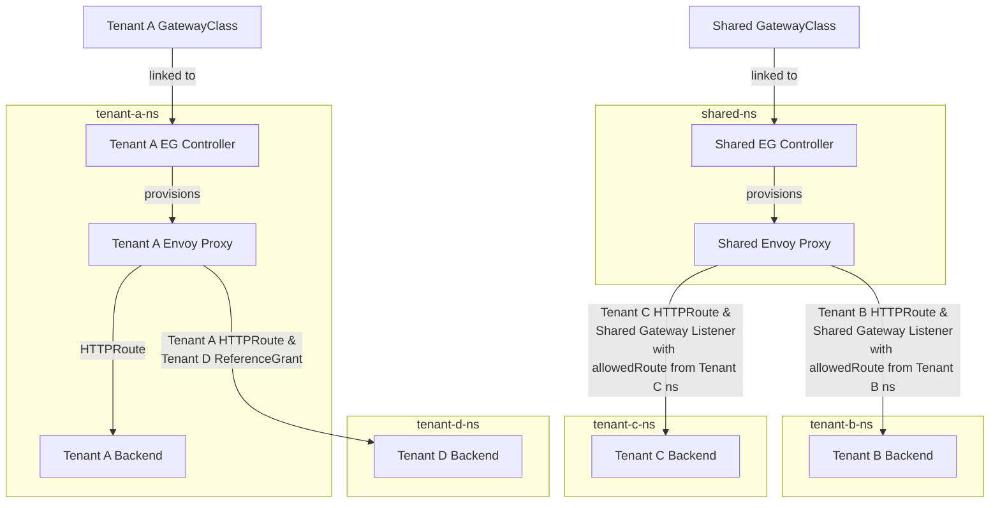

# Threat Modelling Envoy Gateway Talk

## Testing Environment



## Running the Example in a Kind Cluster

Spin up a kind cluster:

```bash
make cluster-up
```

The Envoy Gateway project recommends a [multi-tenancy model](https://gateway.envoyproxy.io/v0.5.0/user/deployment-mode.html) whereby each tenant deploys their own Envoy Gateway controller in a namespace which they own. We will also explore the implications and risks associated with multiple tenants using a shared controller. As such, we will create two Envoy Gateway controllers - one dedicated controller for Tenant A, and one shared controller for Tenants B and C. To create these controllers, run the following (using Envoy Gateway v0.5.0):

```bash
make tenant-a-controller-install
make shared-controller-install
```

Each Envoy Gateway controller can accept a single GatewayClass resource, so let's create a Tenant A and a shared GatewayClass:

```bash
make gwc-tenant-a
make gwc-shared
```

Create the shared Gateway in the `shared` namespace:

```bash
make shared-gw-create
```

Note that the shared Gateway defines a listener which allows routes from the `tenant-b` and `tenant-c` namespaces to attach to it, as per our example architecture:

```yaml
apiVersion: gateway.networking.k8s.io/v1beta1
kind: Gateway
metadata:
  name: eg
  namespace: shared
spec:
  gatewayClassName: eg-shared
  listeners:
    - name: http
      protocol: HTTP
      port: 8080
      allowedRoutes:  
        namespaces:
          from: Selector
          selector:
            matchExpressions:
            - key: kubernetes.io/metadata.name
              operator: In
              values:
              - tenant-b
              - tenant-c
```

:warning: We can see how a potential risk could occur by looking at this listener. Imagine that instead of the `kubernetes.io/metadata.name` label (which is automatically set to the name of the namespace), we used a custom label. In this case, a malicious internal actor with the ability to label namespaces would be able to change the set of namespaces supported by the Gateway. With some social engineering, users of a legitimate service which uses the shared gateway could possibly be tricked into sending traffic to a malicious backend. We can look at an example of this once we've set up our backend services for all the tenants.

Create backend services and deployments for Tenants A, B, C and D, noting that we will also create a dedicated Gateway for Tenant A:

```bash
make run-backend-services
```

Note the creation of `HTTPRoute`s in each of Tenant A, B and C's namespaces. For Tenant A, the `parentRef` is its own Gateway:

```yaml
apiVersion: gateway.networking.k8s.io/v1beta1
kind: HTTPRoute
metadata:
  name: backend
  namespace: tenant-a
spec:
  parentRefs:
    - name: eg
  hostnames:
    - "www.tenant-a.example.com"
  rules:
    - backendRefs:
        - group: ""
          kind: Service
          name: backend
          port: 3000
          weight: 1
      matches:
        - path:
            type: PathPrefix
            value: /
```

For Tenants B and C, the `parentRef` refers to the shared Gateway:

```yaml
apiVersion: gateway.networking.k8s.io/v1beta1
kind: HTTPRoute
metadata:
  name: backend
  namespace: tenant-c
spec:
  parentRefs:
    - name: eg
      namespace: shared
  hostnames:
    - "www.tenant-c.example.com"
  rules:
    - backendRefs:
        - group: ""
          kind: Service
          name: backend
          port: 3000
          weight: 1
      matches:
        - path:
            type: PathPrefix
            value: /
```

For now, we have not set up a route to Tenant D's backend.

### Access Tenant A's Service

Set up port forwarding to the Tenant A Gateway:

```bash
make port-forward-tenant-a
```

Curl the service:

```bash
make curl-tenant-a
```

### Access Tenant B and C Services

Set up port forwarding to the Shared Gateway:

```bash
make port-forward-shared-tenants
```

Curl the Tenant B service:

```bash
make curl-tenant-b
```

Curl the Tenant C service:

```bash
make curl-tenant-c
```

#### Malicious HTTPRoute Example

:warning: We explored the risk earlier that in the context of the shared gateway topology, a tenant could create a malicious backend and HTTPRoute, and attempt to use social engineering techniques to direct a user of a co-tenant's legitimate service to the malicious backend. Let's consider the case where a threat actor has the ability to create HTTPRoutes in the `tenant-c` namespace:

```bash
make malicious-httproute
```

Now let's imagine that this threat actor can trick a user of Tenant B's service to visit `www.tenant-b.example.com/totally-legit`:

```bash
make curl-tenant-b-malicious
```

Note that the response is served by the backend pod in `"namespace": "tenant-c"`

### Exploring ReferenceGrants with Tenant D

So far, we have not set up a route to Tenant D's backend Service. Note that until now, all `HTTPRoute`s have been created in the same namespaces as the backend which they route to.

Imagine someone with the permission to create `HTTPRoute`s in the `tenant-a` namespace (as in [cross-ns-route.yaml](./manifests/cross-ns-route.yaml)) tries to create a route to Tenant D's backend service:

```bash
make cross-ns-route-create
```

If we try to access Tenant D's Service via Tenant A's Gateway, we will see an error:

```bash
make curl-tenant-d
```

In accordance with Gateway API [security principles](https://gateway-api.sigs.k8s.io/concepts/security-model/), for such a cross-namespace connection to succeed, a handshake has to occur between namespaces. In this case, as the `HTTPRoute` was created in the `tenant-a` namespace, a [ReferenceGrant](https://gateway-api.sigs.k8s.io/api-types/referencegrant/) would need to exist in the `tenant-d` namespace. Let's demonstrate this:

```bash
make ref-grant-create
```

Try accessing the Tenant D Service again, and observe that it now works:

```bash
make curl-tenant-d
```

:warning: In this case, if a threat actor with the ability to create a ReferenceGrant in the `tenant-d` namespace wanted to set up an HTTPRoute to a malicious backend, they would need to compromise a service account or set of user credentials which would allow them to create an HTTPRoute in the `tenant-a` namespace.

## Compromised Proxy Scenario

:warning: We have explored what an attacker would need to do in order to create a malicious HTTPRoute. An even more attractive target would be for the attacker to take over an Envoy Proxy instance, either by exploiting an existing vulnerability to achieve RCE (remote code execution), or by configuring Envoy Gateway to deploy a proxy using a vulnerable or maliciously crafted image. Let's look at the more naive case, whereby a new tenant (Tenant E) simply deploys a maliciously crafted Envoy Proxy.

First, we will build an image and load it into our kind cluster. For this demo, we are simply going to install [tcpdump](https://www.tcpdump.org/) on top of an Envoy Proxy base image, and copy in the `tcpdump.sh` script, which we can run from within the container to demonstrate the threat:

```bash
make build-malicious-envoy
```

Envoy Gateway allows you to customise the Envoy Proxy image as per the documentation [here](https://gateway.envoyproxy.io/v0.5.0/user/customize-envoyproxy/#customize-envoyproxy-image). This can be used to ensure that your image complies with any mandated security standards, but in this case, we are going to use our toy maliciously crafted image.

Let's deploy the Tenant E infrastructure, including the new GatewayClass and EnvoyProxy:

```bash
make tenant-e-infra-install
```

Run the `tcpdump.sh` script from within the Envoy Proxy container:

```bash
make exec-into-proxy-e
```

Open a new terminal window, set up port forwarding and curl the Tenant E service:

```bash
make port-forward-tenant-e
make curl-tenant-e
```

Switch back to the original terminal window and observe the request that we just sent being captured. An attacker with access to (or malicious code running inside) a proxy may want to send captured traffic to an attacker controlled service, or tamper with traffic in transit.

## Compromised Controller Scenario

:warning: To affect the Confidentiality, Integrity or Availability of user data, an attacker will ultimately need to compromise the data plane (i.e. the Envoy Proxy). This could be carried out by a malicious insider, as shown in the previous section, or by malicious external actors who could, for example:

- :warning: carry out a supply chain attack resulting in a malicious image being run
- :warning: exploit known vulnerabilities in an unpatched Envoy Proxy
- :warning: exploit weaknesses in the Kubernetes cluster to move laterally from a compromised pod to an Envoy Pod

:warning: To further explore the consequences of [multi-tenancy](https://gateway.envoyproxy.io/latest/user/deployment-mode/#multi-tenancy), let's consider a general scenario where we have multiple Gateways in different namespaces within the cluster (each referencing a different GatewayClass). Within this simple scenario, one of the Gateway pods is compromised (e.g. through one of the above routes). Now, could our attacker modify an EnvoyProxy in a different namespace to that of the compromised Envoy Gateway?

Note that in our example, we have not used Envoy Gateway's [namespaced mode](https://github.com/envoyproxy/gateway/pull/1656) which will be available in v0.6.0, so each Envoy Gateway has Kubernetes permissions defined by a ClusterRole, and watches for resources in all namespaces as detailed [here](https://gateway.envoyproxy.io/latest/user/deployment-mode/). Let's imagine that Tenant A has been compromised, and the attacker wants to modify the Shared Envoy Proxy. Firstly we can look at the Envoy Gateway ClusterRole used by Tenant A's Gateway:

```bash
kubectl describe clusterrole eg-tenant-a-gateway-helm-envoy-gateway-role | grep envoyproxies
```

Note that we cannot patch existing envoy proxies, so by using Tenant A's Envoy Gateway Service Account, our attacker will not be able to modify the EnvoyProxy referred to by the Shared GatewayClass. However, note that we can patch GatewayClasses:

```bash
kubectl describe clusterrole eg-tenant-a-gateway-helm-envoy-gateway-role | grep gatewayclasses
```

Let's use the `./scripts/perform-action-as-gateway.sh` script to see if we can patch the Shared GatewayClass to use a malicious EnvoyProxy in the `tenant-a` namespace using the Envoy Gateway's Service Account. Firstly we will create the EnvoyProxy (note that this resource cannot be created using the EG Service Account):

```bash
make create-malicious-proxy
```

Now we will patch the Shared GatewayClass using the Tenant A Gateway Service Account:

```bash
make patch-gatewayclass
```

Let's force the Envoy Gateway and Proxy pods to restart:

```bash
make restart-shared-pods
```

Observe that the Envoy image has not changed!

```bash
make grep-shared-envoy-image
```

This is by design in Gateway API! As per the [API specification](https://gateway-api.sigs.k8s.io/v1alpha2/references/spec/#gateway.networking.k8s.io/v1alpha2.GatewayClass): "a Gateway is based on the state of the GatewayClass at the time it was created and changes to the GatewayClass or associated parameters are not propagated down to existing Gateways. This recommendation is intended to limit the blast radius of changes to GatewayClass or associated parameters."

:warning: However, we must still be careful with ClusterRoles. For example, we can check that the Tenant A Envoy Gateway can observe secrets across the cluster:

```bash
./scripts/perform-action-as-gateway.sh kubectl describe secrets -A
```

## Talk Demos

The minimal base infra required to run the demos for the talk can be set up using:

```bash
make demo-base-infra
```

The `demo-magic` scripts [demo-1.sh](./demo-1.sh), [demo-2.sh](./demo-2.sh), and [demo-3.sh](./demo-3.sh) can then be run in order.

## Teardown

If you are still port warding connections, you can stop by running:

```bash
make stop-port-forwarding
```

To delete the kind cluster, run:

```bash
make cluster-down
```
